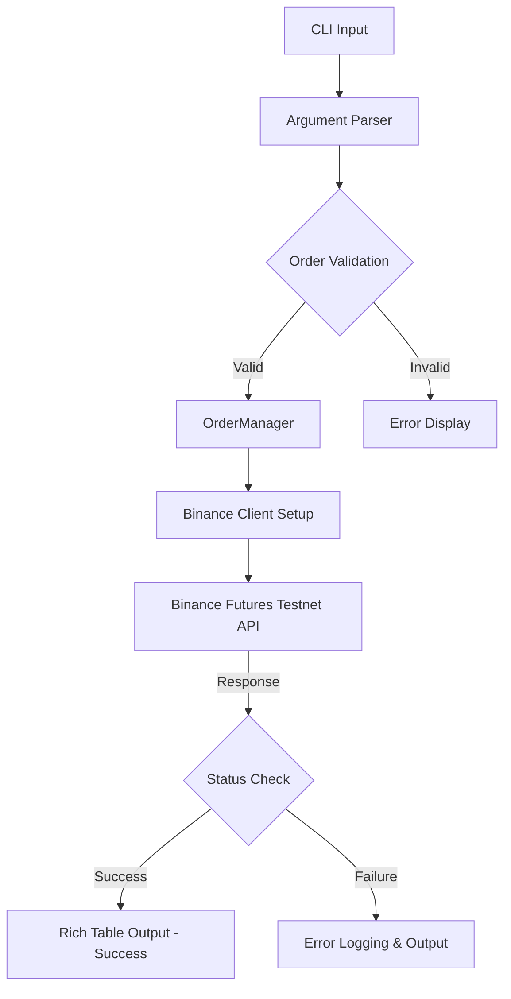

# 📈 Binance Futures Testnet Trading Bot

A robust, CLI-based Python trading bot built for executing trades on the Binance Futures Testnet. It provides a clean terminal interface and structured backend to submit, validate, and track orders safely without using real funds.

## 🚀 Key Features
- **Command Line Interface (CLI):** Interactive and beautifully formatted output using `rich`.
- **Binance Futures Testnet Integration:** Leverages `python-binance` to communicate with the Testnet API.
- **Robust Validation:** Prevents bad order parameters from being sent to the exchange.
- **Environment Driven:** Securely loads API credentials via `.env` file.
- **Structured Logging:** Tracks execution flow and API responses for easy debugging.

## 🛠️ Tech Stack & Tool Kit
- **Language:** Python 3.x
- **Frameworks/Libraries:** 
  - `python-binance` (Binance API Wrapper)
  - `rich` (Terminal Formatting)
  - `python-dotenv` (Environment Management)
- **API:** Binance Futures Testnet API

## 🧠 System Architecture & Flowchart



## 📁 Project Structure

```text
Trading-Bot-Binance-Futures-Testnet/
│
├── trading_bot/
│   └── bot/
│       ├── __init__.py
│       ├── client.py         # Binance Client setup and connection
│       ├── logging_config.py # Structured logging configuration
│       ├── orders.py         # Order execution logic (OrderManager)
│       └── validators.py     # Parameter validation rules
│
├── .env                      # API Keys (Not pushed to GitHub)
├── cli.py                    # Main Command Line Interface script
├── requirements.txt          # Project dependencies
└── README.md                 # Project Documentation
```

## ⚙️ Step-by-Step Setup Instructions

### 1. Clone the Repository
```bash
git clone https://github.com/Adithya-J05/Trading-Bot-Binance-Futures-Testnet-.git
cd Trading-Bot-Binance-Futures-Testnet-
```

### 2. Create a Virtual Environment (Recommended)
```bash
python -m venv .venv
# Activate on Windows:
.\.venv\Scripts\activate
# Activate on Mac/Linux:
source .venv/bin/activate
```

### 3. Install Dependencies
```bash
pip install -r requirements.txt
```

### 4. Configure Environment Variables
Create a `.env` file in the root directory and add your Binance Testnet API credentials:
```env
BINANCE_API_KEY=your_testnet_api_key
BINANCE_API_SECRET=your_testnet_api_secret
```

### 5. Run the Bot! 
Execute trades directly from your terminal using `cli.py`:

**Example Command (Market Buy):**
```bash
python cli.py --symbol BTCUSDT --side BUY --type MARKET --qty 0.001
```

**Example Command (Limit Sell):**
```bash
python cli.py --symbol ETHUSDT --side SELL --type LIMIT --qty 0.05 --price 3500.00
```

## ⚠️ Disclaimer
This bot is strictly configured for the **Binance Testnet** for educational and testing purposes. Do not use this directly on the live exchange without comprehensive modifications and risk management.
